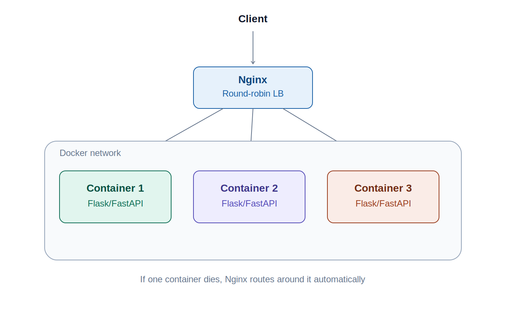
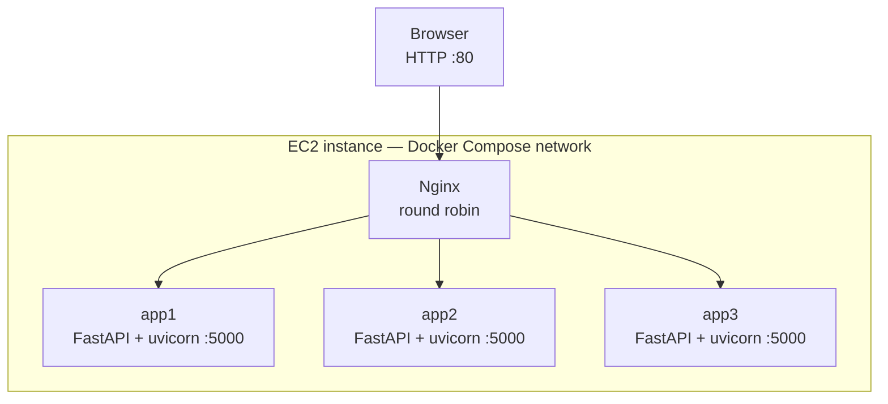
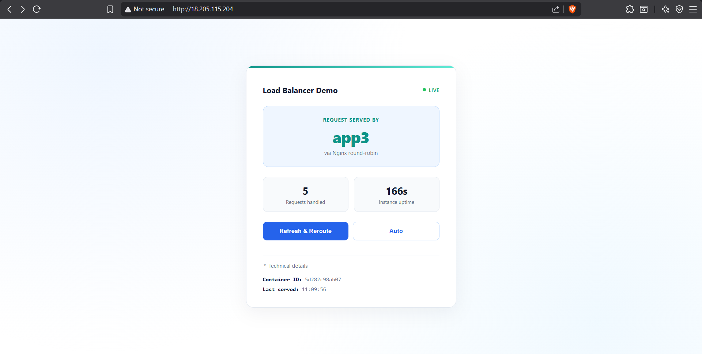
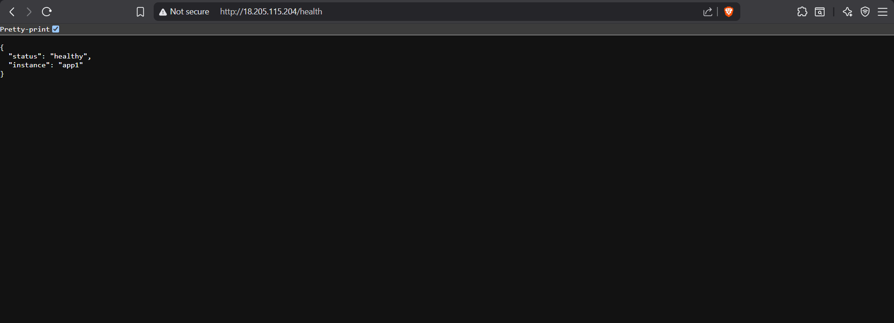

# Nginx Load Balancer Demo
 
3 identical FastAPI containers behind an Nginx reverse proxy, round-robin load balanced, running on a single EC2 instance via Docker Compose.
 
## The problem
 
A single container is a single point of failure. One crash takes the whole service down. You also can't deploy an update without downtime.
 
## The fix
 
Run 3 identical containers instead of 1, and put Nginx in front of them to distribute traffic. If one container dies, the other two keep serving. You can update one container at a time with zero downtime. You can also handle more request volume since load is spread across 3 processes instead of 1.
 
## Architecture
 

 

 
Each container is built from the same image, only differentiated by an `APP_NAME` environment variable, so the UI can show which instance actually served a given request.
 
## Stack
 
- **FastAPI + uvicorn** — app layer, 1 worker per container (load balancing happens across containers, not across workers)
- **Nginx** — reverse proxy, round-robin `upstream` block, retries the next container on error/timeout
- **Docker Compose** — orchestrates all 4 containers on one EC2 instance
## Run it
 
```bash
docker compose up -d --build
```
 
Visit `http://<your-ec2-ip>` — the container name (app1/app2/app3) is shown on the page and changes as you refresh.
 
## Proving it works
 
```bash
# Watch requests rotate across containers
for i in {1..6}; do curl -s http://localhost | grep -A1 "Served by"; done
 
# Kill one mid-traffic — the other two keep serving
docker stop lb-app2
for i in {1..6}; do curl -s http://localhost | grep -A1 "Served by"; done
 
# Bring it back
docker start lb-app2
 
# Zero-downtime rolling update, one container at a time
docker compose up -d --build --no-deps app1
docker compose up -d --build --no-deps app2
docker compose up -d --build --no-deps app3
```
 
## Live demo
 
Deployed on a single EC2 instance. The page shows which container answered the request, and `/health` confirms that instance is up:
 

 

 
## Project structure
 
```
.
├── main.py              # FastAPI app, reports its own instance name
├── requirements.txt
├── Dockerfile           # shared image for all 3 app containers
├── docker-compose.yml   # 3 app services + nginx
├── nginx.conf           # upstream block, round robin
├── screenshots/
│   ├── architecture.png
│   ├── live-demo.png
│   └── health-check.png
└── templates/
    └── index.html       # shows which container served the request
```
 
## What this demonstrates
 
- Horizontal scaling with stateless containers
- Nginx reverse proxy configuration and upstream health handling
- Zero-downtime rolling deployments
- Docker Compose multi-container orchestration
## Flask variant
 
A second version of the app layer (`app.py`, Flask + Gunicorn instead of FastAPI + uvicorn) lives in `nginx-lb-demo-flask/`. Same Dockerfile pattern, same `docker-compose.yml` and `nginx.conf` — the point is that Nginx doesn't care what's behind it, as long as it responds on port 5000.
 
## Scope note
 
This project is focused on the infrastructure layer — the Dockerfile, Compose orchestration, and Nginx load balancing config are the actual subject of the project and what I built and configured myself. The backend app (FastAPI or Flask) is intentionally minimal — its only job is to report which container answered the request, so the load balancing is visible.
 
